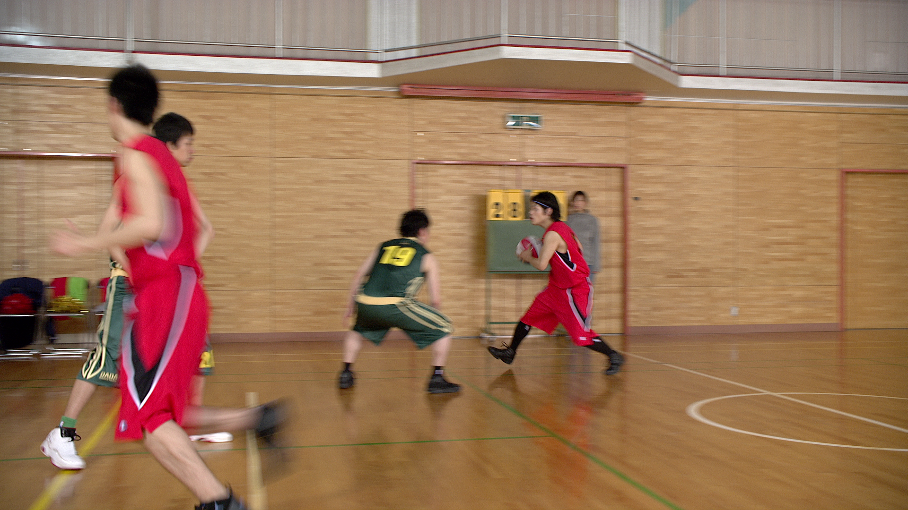
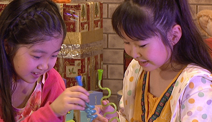
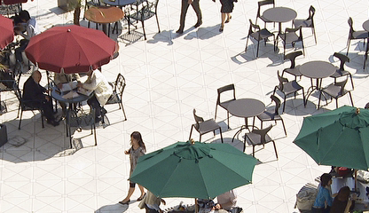
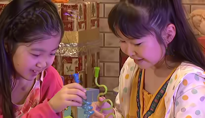
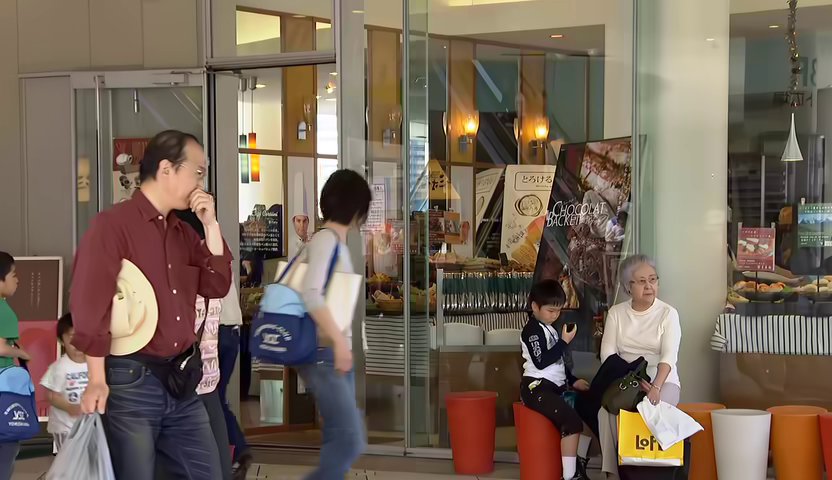
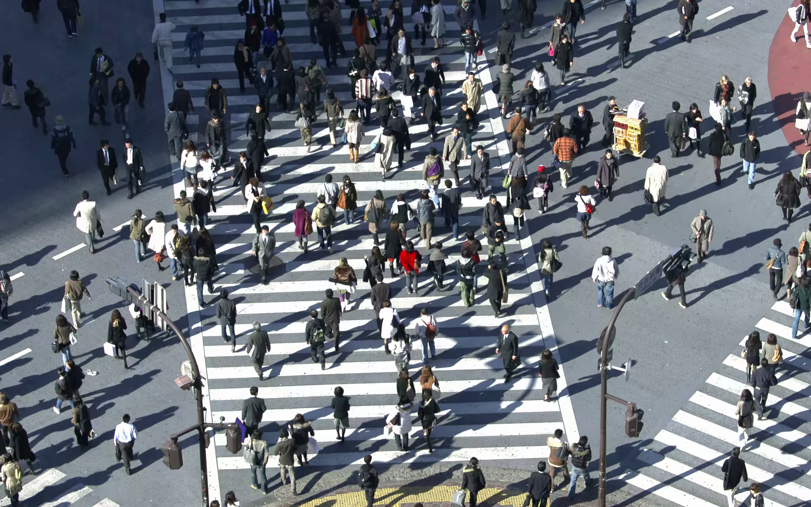

<div align="center">
 <br>
<h1>Large Capacity H.265/HEVC Video Steganography Based on Polygon Encoding and Improved Deep Learnable Similarity Network</h1>
</div>

## ⏳ Quick Start
### 1. Description
```
HM 16.15 integrates IDLSNF by invoking cnndemo to replace the HEVC in-loop filter.
The steganalysis tools used in this work were developed by other researchers and are not our original contributions. Therefore, these components have been encrypted in the released code. Researchers who wish to use them must obtain permission from the respective authors.
```
### 2.Getting datasets
| Datasets          |    Paper                                                                                                               |    Url    |
|:------:           |:---------:                                                                                                             |:---------:|
| DIV2K  | Global Learnable Attention for SingleImage Super-Resolution (TPAMI 2023)                                                          |  [[Google Drive](https://data.vision.ee.ethz.ch/cvl/DIV2K/)]|

## ⏳ IDLSNF Training
```
 python main.py --dir_data [training datasets path] --data_range [datasets] --n_GPUs 1 --rgb_range 1 --chunk_size 128 --n_hashes 3 --save_models --lr 1e-5 --decay 200-400-600-800 --epochs 1000 --chop --save_results --data_test Set5 --n_resgroups 10 --n_resblocks 4 --n_feats 64 --reduction 4 --res_scale 1 --batch_size 4 --model DLSN --scale 1 --patch_size 128 --save DLSN_x1 --data_train DIV2K
```
## ⏳ Subjective visual results
<div>
<table border="1" cellspacing="5" cellpadding="5" style="text-align: center;">
  <tr>
    <th>Original</th>
    <td></td>
    <td></td>
    <td></td>
    <td></td>
    <td></td>
    <td></td>
    <td></td>
  </tr>

  <tr>
    <th>Stego</th>
    <td></td>
    <td></td>
    <td></td>
    <td></td>
    <td></td>
    <td></td>
    <td></td>
  </tr>
</table>
<table border="1" cellspacing="5" cellpadding="5" style="text-align: center;">
  <tr>
    <th>Original</th>
    <td></td>
    <td></td>
    <td></td>
    <td></td>
    <td></td>
    <td></td>
    <td></td>
  </tr>
  <tr>
    <th>Stego</th>
    <td></td>
    <td></td>
    <td></td>
    <td></td>
    <td></td>
    <td></td>
    <td></td>
  </tr>
</table>

</div>


